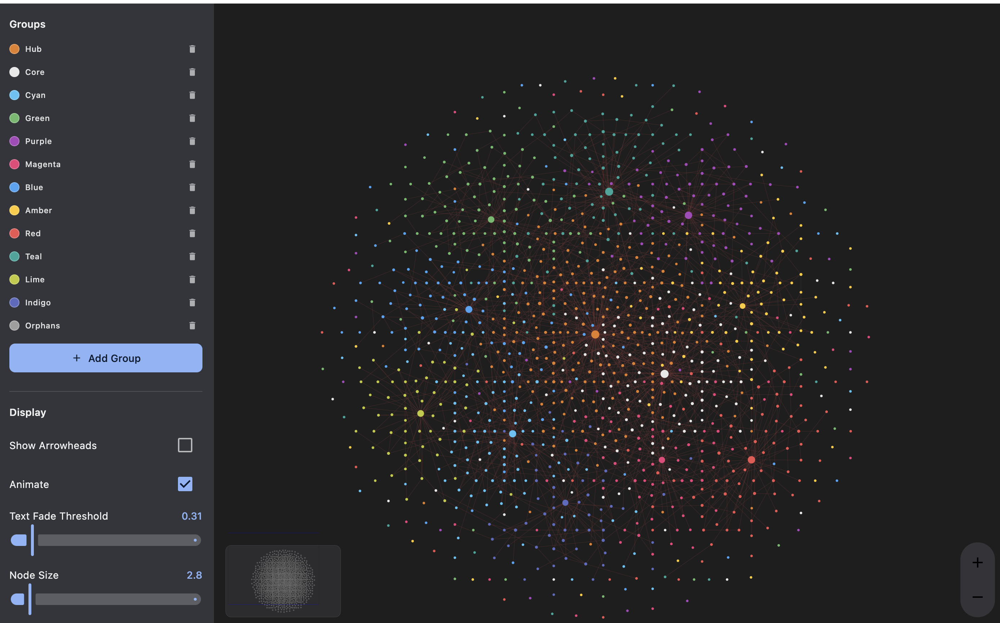
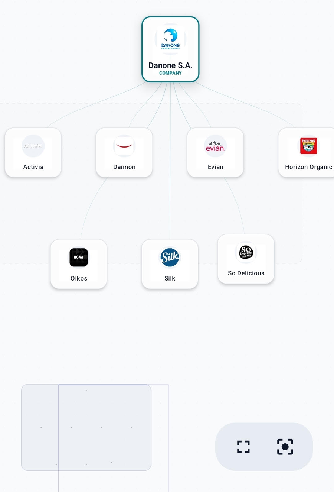

# KmpGraphine

[](LICENSE)
[](https://kotlinlang.org)
[](https://repo1.maven.org/maven2/io/karpilabs/kmp-graphine)
[](https://gradle.org)

A modern graph and hierarchy visualization library for **Kotlin Multiplatform** and **Jetpack Compose**.

KmpGraphine offers an interactive way to explore relational data with a polished canvas feel.


*Modern dot grid background with glassmorphism nodes and path highlighting.*

## Core Features

- Infinite canvas: smooth panning and pinch to zoom from 0.1x to 5.0x.
- Subtle dot grid background, gradient edges, and dashed group zones.
- Built in intelligence:
  - Semantic zoom: labels and metadata appear or fade based on scale.
  - Path highlighting: trace ownership chains with focused dimming.
- Layout engines:
  - Tree layout: hierarchical branching with grid based clustering for dense node sets.
  - Force directed layout: organic, physics based positioning.
- UI components: built in `Minimap`, `GraphControls`, and `ZoomControls`.

## Usage

### 1. Define your data
KmpGraphine works with any data model using the generic `GraphNode<T>`.

```kotlin
val nodes = listOf(
    GraphNode(id = "1", data = "Parent"),
    GraphNode(id = "2", data = "Child A"),
    GraphNode(id = "3", data = "Child B")
)
val edges = listOf(GraphEdge(from = "1", to = "2"), GraphEdge(from = "1", to = "3"))
```

### 2. State and surface
Initialize the state and place `GraphSurface` in your UI. Customize your edge connections by configuring the `EdgeStyle`: `STRAIGHT`, `CURVED` (Cubic Bézier), or `ORTHOGONAL` (stepped right-angle routing, perfect for hierarchical and organizational charts).

```kotlin
val state = rememberGraphState(nodes, edges)

GraphSurface(
    state = state,
    edgeConfig = EdgeConfig(
        style = EdgeStyle.ORTHOGONAL, // STRAIGHT, CURVED, or ORTHOGONAL
        showArrowheads = true
    ),
    nodeContent = { node, isDetailVisible ->
        // Use any Composable as your node
        MyNodeCard(node.data, showText = isDetailVisible)
    }
)
```

### 3. Viewport controls
Add the floating toolbar and minimap for easier navigation.

```kotlin
Box(Modifier.fillMaxSize()) {
    GraphSurface(state = state, ...)

    Minimap(state = state, modifier = Modifier.align(Alignment.TopStart))

    GraphControls(state = state, modifier = Modifier.align(Alignment.BottomEnd))
}
```

## Sample apps
Runnable Compose Desktop apps demonstrate the library.

**`sample`** — a minimal org chart mirroring the [Usage](#usage) snippets above: just `GraphSurface` with a handful of nodes and edges.

```bash
./gradlew :sample:run
```

**`sample-showcase`** — a "maxed out" demo exercising most of the library's surface: switchable `TreeLayout` (straight and radial) and `ForceDirectedLayout`, `GraphGroup` department zones, arrowhead edges, path highlighting, semantic zoom, and the built-in `Minimap`, `GraphControls`, `ZoomControls`, and `GraphSearch` overlays.

**Graph View** (`sample-graph-view`) — large graph demo: 1000+ canvas dots, live force-directed physics, groups/display/forces settings panel.

```bash
./gradlew :sample-graph-view:run
# or
make sample-graph-view
```



*Interactive graph visualization with live force simulation and customizable display settings.*

```bash
./gradlew :sample-showcase:run
```

## Real world example: Investigo
In the **Investigo** app, KmpGraphine is used to visualize large corporate ownership trees.



*Example: Visualizing a corporate ownership tree in Investigo.*

## Publishing

For instructions on publishing to Maven Central, see [PUBLISHING.md](PUBLISHING.md).

## Library roadmap
- Edge routing to avoid node overlap
- Box and lasso selection for bulk operations
- Node connector ports for drag to link
- SVG and PNG export

---

## Strategy & Suggestions to Drive Adoption

To make **KmpGraphine** the go-to graph and hierarchy visualization library for the Kotlin Multiplatform ecosystem, we propose several impactful strategies categorized by feature enrichment, user experience, developer advocacy, and ecosystem integration.

### 1. Enrich Interactive Capabilities
- **Manhattan / Orthogonal Routing (Added!)**: Great for diagrams, trees, and classic org charts.
- **Dynamic Port Connections**: Allow specific "ports" on nodes (Top, Bottom, Left, Right) to connect edges, preventing lines from crossing through node card bodies.
- **Lasso & Box Selection**: Allow drag-to-select multiple nodes simultaneously to move, delete, or group them in bulk.
- **Edge Routing & Obstacle Avoidance**: Integrate a routing algorithm (like A* or pathfinder) to automatically route edges around non-connected node bounds.

### 2. High-Performance rendering & Optimization
- **Lazy Canvas / Lazy Layout Nodes**: Currently, 1000+ nodes render fine, but scaling to 10k+ requires a `LazyLayout`-like virtualized composable or a canvas-only fallback when zoomed far out.
- **WebAssembly (Wasm) Compatibility**: Kotlin Multiplatform Web (Wasm) is rapidly growing. Ensuring KmpGraphine works flawlessly out-of-the-box on Kotlin/Wasm would attract web developers.

### 3. Developer Experience (DX) & Advocacy
- **Interactive Documentation Portal / Storybook**: Build a Compose HTML / Wasm showcase page where developers can interactively tweak layouts, edge styles, animations, and instantly copy-paste code snippets.
- **Templates Gallery**: Provide pre-built templates for common use-cases, e.g., Family Trees, Mind Maps, Flowcharts, State Machines, and Org Charts.
- **Detailed Getting Started Guides**: Expand on real-world integrations (like the corporate ownership tree in Investigo) with blog posts on Medium, Dev.to, or YouTube videos demonstrating KmpGraphine.
- **Flawless Test Suite**: Keep the test suite 100% green and integrated with CI to guarantee stability and build confidence for production-ready adoption.
